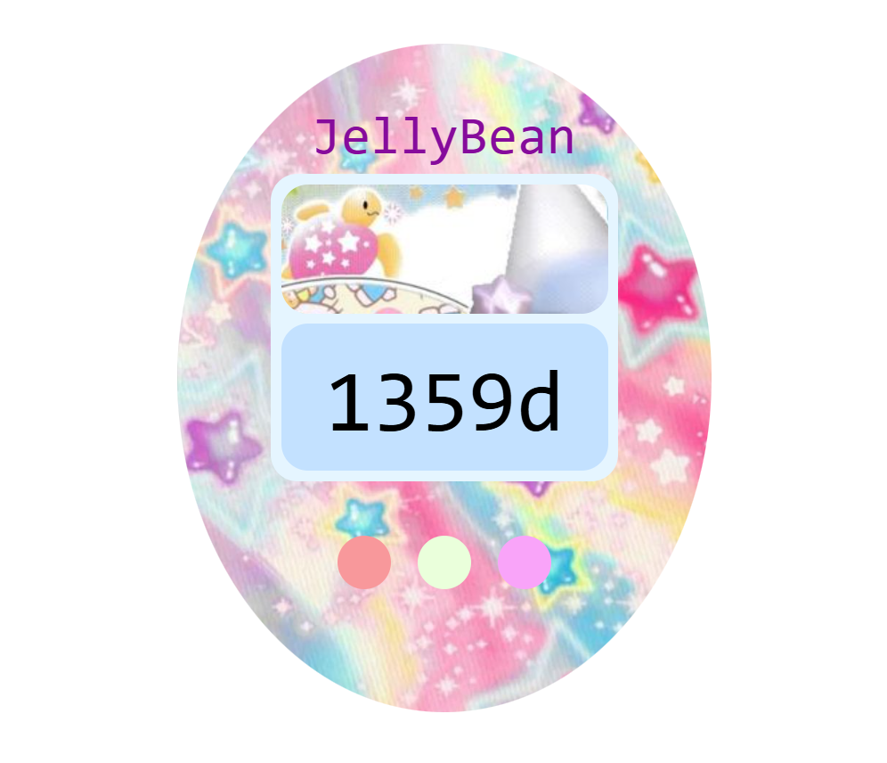

# $${\color{Purple}JellyBean}$$
$${\color{Purple}JellyBean}$$ is a whimsical and nostalgic countdown timer built with JavaScript, counting down to my 25th birthday in 2029 styled in a sparkly Trinketscore aesthetic. However, you can set the date to whatever events you want to celebrate!



## How to Use
1. Clone or download the repository.
2. Open `index.html` in your browser.
3. The countdown will automatically update to show the number of days remaining.

> You can change the date to your birthdate by editing the countDownDate in the `script.js` code:
```js
var countDownDate = new Date("Apr 1, 2029").getTime();
```
## Future Plans
- [ ] Add a big celebratory animation (confetti, sparkle burst, sound effect) when the countdown reaches zero.
- [ ] A GIF background.

## Credits
Images are from $${\color{Red}Pinterest}$$.
